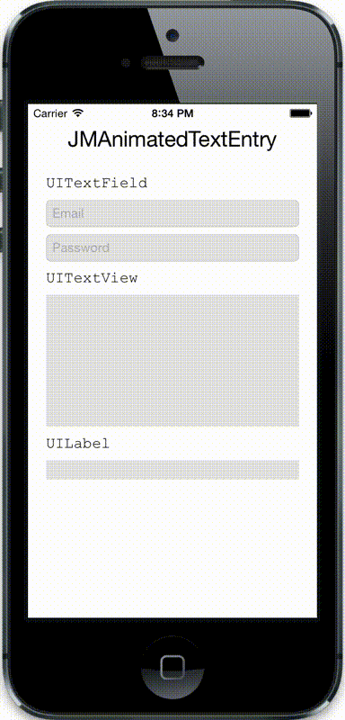

# JMAnimatedTextEntry

JMAnimatedTextEntry allows you to easily animate text entry on `UIKit` components.



## Usage

#### Basic
`JMAnimatedTextEntry` adds methods to `UIKit` components that have the `text` property. To animated the entry of text simply:

```objective-c
UILabel *label = ...;

[label jm_setText:@"Some text" animatedWithDuration:1.0 completion:^(BOOL finished) {
	if	(finished) {
	  // Text has finished animating.
	} else {
	  // Text entry was interrupted.
	}
}];
```

If text is being animated and you need it to stop, simply call:

```objective-c
[label jm_stopTextAnimation];
```

#### Advanced
It's actually very easy to add `JMAnimatedTextEntry` methods to any class that has the `text` property. Let's say for example you have a label class that displays text in a spiral. You could enable animated text entry on it simply by adding the `JMAnimatedTextEntry` protocol:

```objective-c
@interface SpiralLabel : UIView <JMAnimatedTextEntry>

...

@property NSString *text;

...

@end
```

And then adding the following to the `+initialize` method on the class:

```objective-c
+ (void)initialize {
	if	([self class] == [SpiralLabel class]) {
		[JMAnimatedTextEntryRegistration registerAnimatedTextEntryClass:[SpiralLabel class]];
	}
}
```

After this you can safely call:

```objective-c
SpiralLabel *spiralLabel = ...;

[spiralLabel jm_setText:@"Some spiral text" animatedWithDuration:0.5 completion:nil];
```

## Disclaimer

At this point, this project most likely works but has not been extensively tested. It uses the Objective C runtime to add the `JMAnimatedTextEntry` methods to the classes which isn't exactly standard operating procedure.

## Creator

[Joey Meyer](http://www.joeymeyer.com)

## License

JMAnimatedTextEntry is available under the MIT license. See the LICENSE file for more info.
